# SceneVerse AI Frontend

SceneVerse AI is a web-first agentic movie companion. It lets a viewer pause a video scene, capture the frame, generate scene context, create character agents, and speak to the movie world through a coordinated multi-agent system.

Tagline:

```text
Pause the movie. Step into the world.
```

This repository contains the Vercel-hosted frontend for the hackathon demo. SceneVerse uses a microservice-style architecture: the frontend and backend are independently deployed services connected through the `/backend/*` API boundary.

## Table Of Contents

- [Repository Links](#repository-links)
- [Hackathon Feature Highlights](#hackathon-feature-highlights)
- [Demo Preview](#demo-preview)
- [What The Frontend Does](#what-the-frontend-does)
- [Hackathon Architecture](#hackathon-architecture)
- [Product Flow](#product-flow)
- [Tech Stack](#tech-stack)
- [Routes](#routes)
- [Backend API Contract](#backend-api-contract)
- [Scene Outlining](#scene-outlining)
- [Important Source Files](#important-source-files)
- [Environment And Proxying](#environment-and-proxying)
- [Run Locally](#run-locally)
- [Build](#build)
- [Deployment](#deployment)
- [Demo Notes](#demo-notes)

## Repository Links

| Service | Repository | Deployment Role |
| --- | --- | --- |
| Frontend | [MikaCarapiet/agentic-vr-frontend](https://github.com/MikaCarapiet/agentic-vr-frontend) | Vercel-hosted React/Vite user interface |
| Backend | [sayyidkhan/agentic-vr-backend](https://github.com/sayyidkhan/agentic-vr-backend) | AWS-hosted FastAPI service for agents, data, media, AI, Exa, and Stripe |

Architecture boundary:

```text
frontend service -> /backend/* -> backend service
```

## Hackathon Feature Highlights

These frontend features are highlighted against the NEXT hackathon manual in the backend repo at [docs/proposal/hackthon-info.md](https://github.com/sayyidkhan/agentic-vr-backend/blob/main/docs/proposal/hackthon-info.md). The frontend is designed to make the agentic system visible, demoable, and easy for judges to understand.

### Sponsor Stack Coverage

| Hackathon Stack | Frontend Feature | Code / Config |
| --- | --- | --- |
| Vercel | Deployable React/Vite web app with `/backend/*` rewrite to the AWS API | `vercel.json`, `vite.config.ts` |
| AWS | Calls AWS-hosted FastAPI backend through the proxy boundary | `src/sceneverseApi.ts` |
| Exa | Displays Exa-backed research and collectible context inside the scene experience | `src/App.tsx`, `src/sceneverseApi.ts` |
| Stripe | Starts premium unlock flow through backend Checkout API | `src/App.tsx`, `src/sceneverseApi.ts` |

### Judging Criteria Alignment

| Manual Criteria | Frontend Evidence |
| --- | --- |
| Agent Overview | Shows character agents, Director Agent responses, memory updates, and agent trace UI. |
| Autonomy & Decision-Making | Sends user intent and playback context to the backend orchestrator, then renders the selected route and responding agent. |
| Actions & Tool Use | Provides video controls, frame capture, voice input, Exa collectible display, Stripe checkout trigger, and speech playback. |
| Orchestration | Visualizes multi-agent work through the agent activity timeline and response history. |
| Human-in-the-Loop | Viewer chooses videos, pauses scenes, asks questions, selects agents, confirms cart/checkout actions, and can return to catalogue/admin views. |
| Failure Handling | Includes frontend fallback state, local event logs, loading states, and retry-friendly API calls for demo continuity. |
| Demo & Presentation | Uses large cinematic video, voice-first controls, visible scan effects, and screenshots suitable for a screen-recorded demo. |

### Frontend Feature Map

| Feature | What It Does | Main Files |
| --- | --- | --- |
| Video catalogue | Lets users browse and open interactive videos | `src/MovieCatalogPage.tsx`, `src/videoCatalog.ts` |
| Immersive video player | Plays the selected video and manages playback state | `src/App.tsx` |
| Pause-to-frame capture | Captures the current video frame into a Canvas data URL for scene analysis | `src/App.tsx` |
| Scene generation UI | Sends frame/context to backend and renders generated scene/character state | `src/App.tsx`, `src/sceneverseApi.ts` |
| Agent trace UI | Shows the work performed by parser, agents, memory, research, and tools | `src/App.tsx`, `src/appLogger.ts` |
| Vera voice interface | Uses browser microphone and OpenAI Realtime transcription token flow | `src/openaiRealtimeTranscription.ts` |
| Scene outline overlay | Draws cinematic scan/outline effects on top of the video | `src/SceneCompositionCanvas.tsx`, `src/sceneVision.ts` |
| VR/stereo mode | Provides a lightweight immersive viewer | `src/VRSceneView.tsx`, `src/StereoViewer.tsx` |
| Exa collectible moment | Shows external research/commerce context inside the scene | `src/App.tsx`, `src/sceneverseApi.ts` |
| Stripe unlock trigger | Calls backend checkout service for premium flow | `src/App.tsx`, `src/sceneverseApi.ts` |
| Admin video tools | Adds, uploads, edits, prepares, and deletes catalogue videos | `src/AdminVideosPage.tsx` |
| Local logs | Helps demo and debug the frontend event flow | `src/LogsPage.tsx`, `src/appLogger.ts` |

## Demo Preview

The screenshots below are stored in `public/readme-assets/demo/`. They show the intended screen-recording path for the hackathon demo: browse a generated scene, step into the moment, talk to agents, retrieve Exa-backed commerce context, add an item to the scene cart, and switch into the stereo/VR experience.

| Demo Moment | What It Shows | Screenshot |
| --- | --- | --- |
| Catalogue landing | The public Vercel frontend opens on a cinematic catalogue, with the generated Yoda vs Vader scene as the featured premiere. | 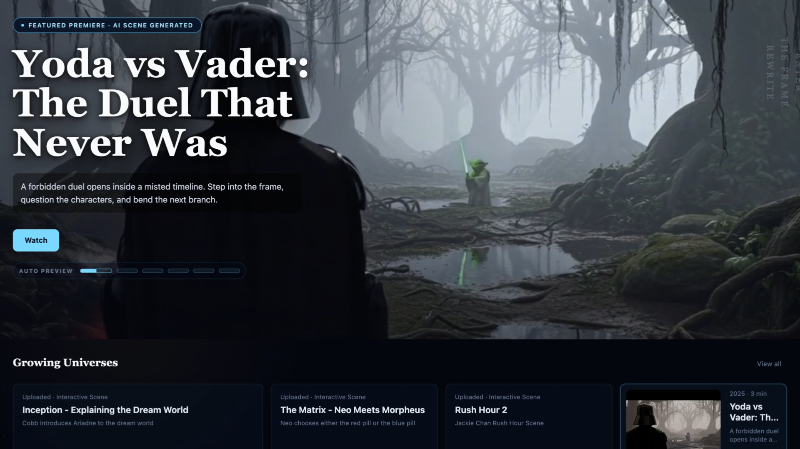 |
| Scene generation | The viewer enters a scene, the frame is captured, the Scene Parser runs, agents are created, and memory is initialized. | 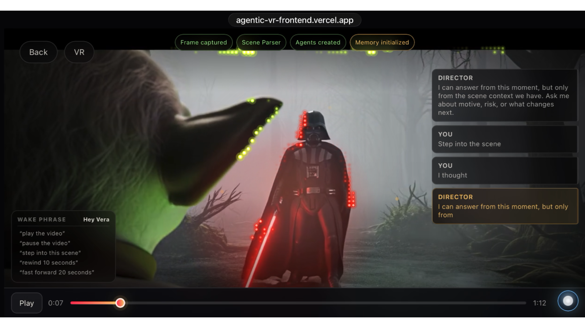 |
| Director opens the scene | The Director Agent confirms that the viewer is now inside the scene and can ask scene-grounded questions. | 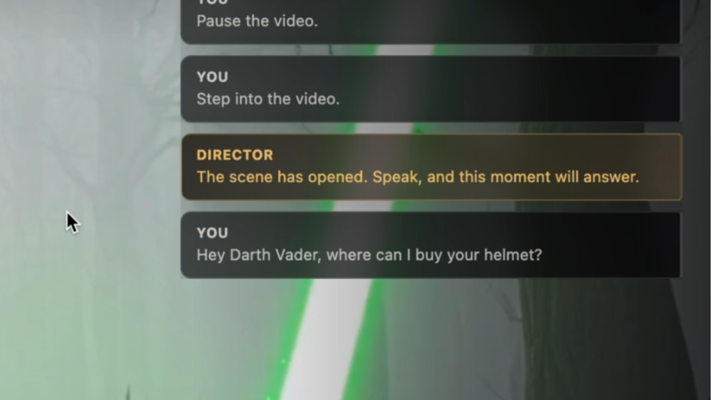 |
| Voice command history | Vera captures spoken commands like pause and step into scene, showing the voice-first interaction path. | 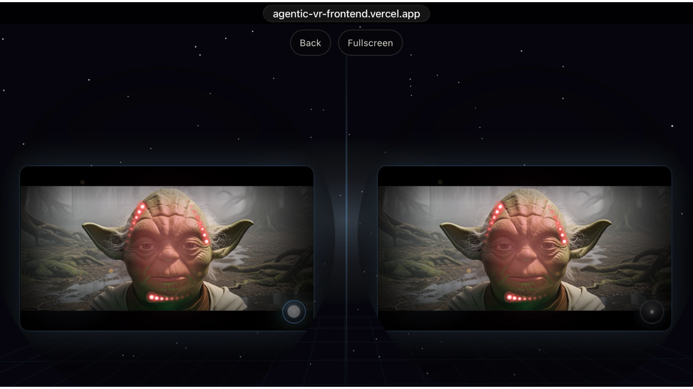 |
| Exa commerce match | The Director uses Exa-backed research to find a likely Darth Vader helmet match from live web context. | 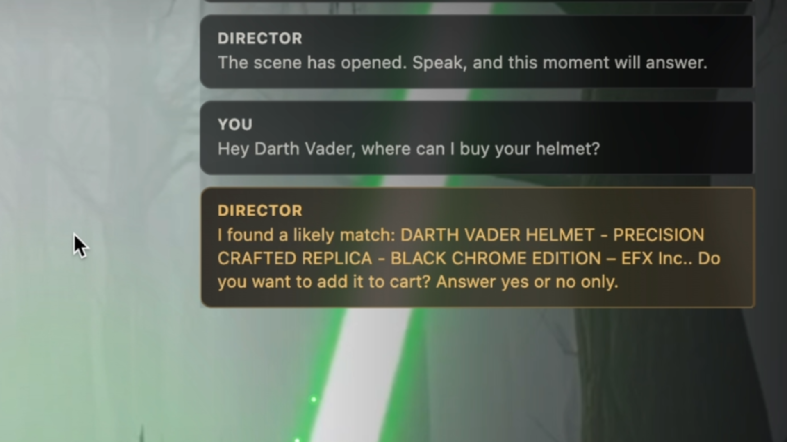 |
| Add-to-cart decision | The app asks for explicit user confirmation before adding the researched item to the scene cart. | 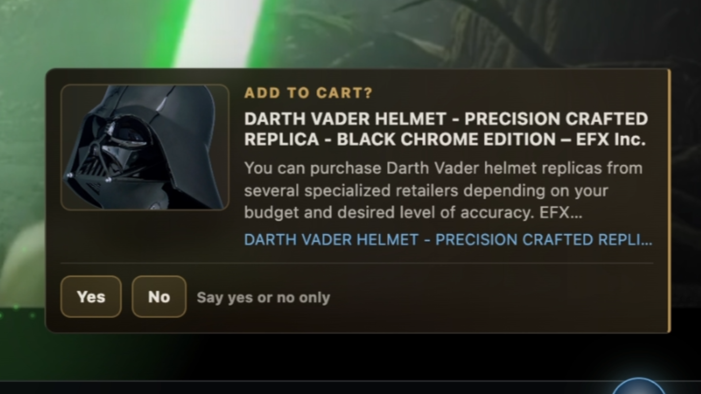 |
| Scene cart | The cart stores the selected in-scene collectible, demonstrating the Stripe/commerce monetization path. | 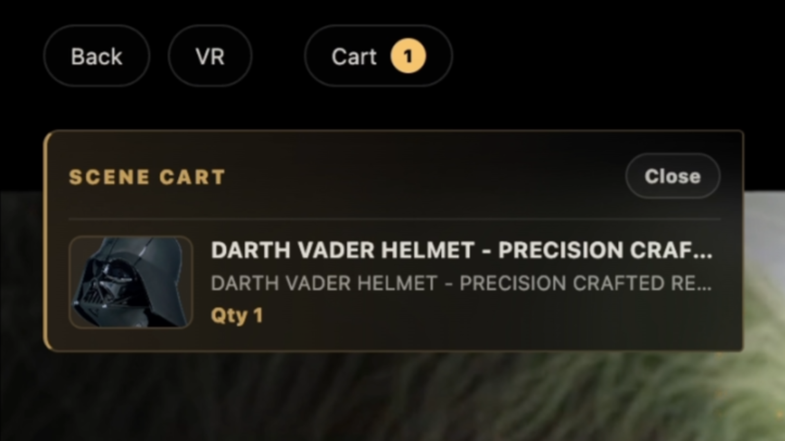 |
| VR entry | The in-scene UI exposes a VR entry button for switching from cinematic mode to immersive viewing. | 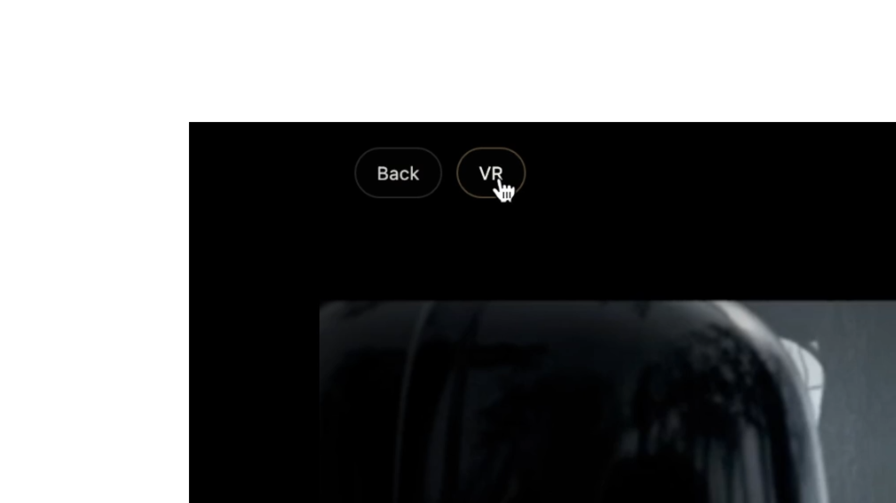 |
| Stereo Yoda view | The stereo viewer renders the same scene in a split-eye layout, suitable for headset-style presentation. | 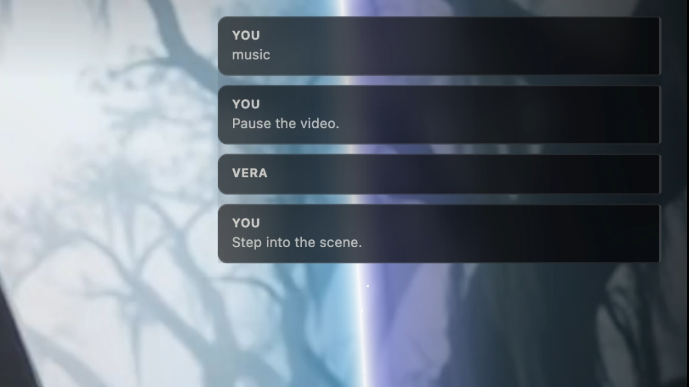 |
| Stereo Vader view | The stereo viewer also works with the Vader scene, preserving the immersive mode across catalogue videos. | 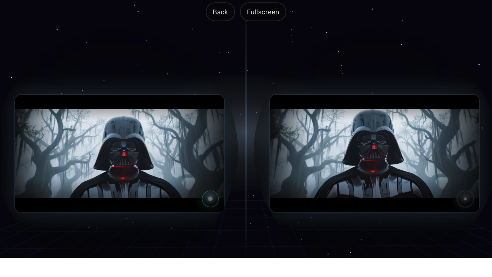 |

## What The Frontend Does

- Presents the public video catalogue.
- Plays cinematic clips and handles pause, seek, replay, and fullscreen controls.
- Captures the paused frame into a Canvas image for scene analysis.
- Shows generated scene context, character cards, chat history, and agent activity.
- Provides a voice-first interface through Vera, the in-scene voice assistant.
- Renders a Canvas-based scan/outline overlay over the video.
- Supports an immersive Three.js VR/stereo view.
- Exposes a small admin surface for adding, uploading, editing, and preparing videos.
- Calls the backend through `/backend/*`, so local and deployed environments use the same frontend code path.

## Hackathon Architecture

SceneVerse uses the hackathon sponsor stack directly: Vercel for the frontend, AWS for backend/database/media/AI infrastructure, Exa for agent research, and Stripe for monetization.

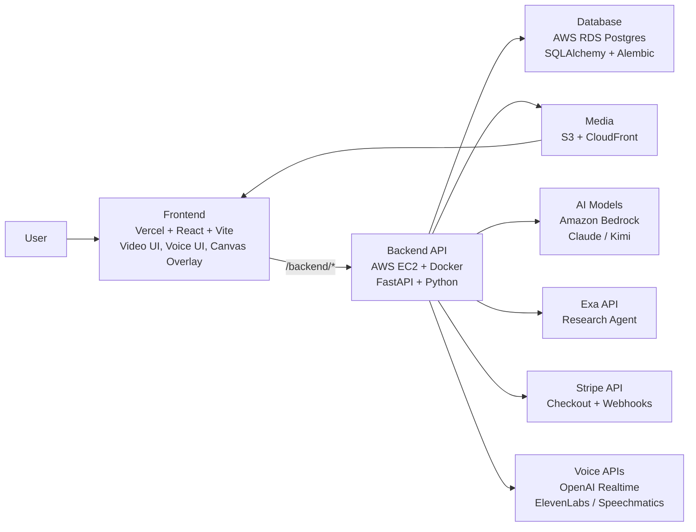

## Product Flow

```text
open catalogue
  -> choose a video
  -> play or pause the scene
  -> capture paused frame
  -> call /api/scenes/analyze
  -> receive scene summary + characters + memory + agent trace
  -> ask a character or Director Agent a question
  -> call /api/chat
  -> show routed response, memory update, and visible orchestration
```

The key demo proof is that a passive video scene becomes an interactive agentic world.

## Tech Stack

| Layer | Tech Stack |
| --- | --- |
| Frontend | React + TypeScript + Vite |
| Styling | Plain CSS |
| 3D / VR | Three.js |
| Video | HTML5 video, Canvas frame capture, Fullscreen API |
| Scene outline | Bedrock character boxes + custom Canvas luma/gradient tracing |
| Voice input | Browser microphone, WebRTC, OpenAI Realtime transcription |
| Backend API | FastAPI through `/backend/*` proxy |
| AI | Amazon Bedrock, Claude, Kimi, custom agents |
| Voice output | ElevenLabs, Speechmatics |
| Search | Exa API |
| Payments | Stripe Checkout + Stripe Webhooks |
| Media | S3 + CloudFront, yt-dlp, ffmpeg |
| Deployment | Vercel frontend, AWS EC2 Docker backend |
| CI / Testing | GitHub Actions, pytest on backend |

## Routes

| Route | Purpose |
| --- | --- |
| `/videos` | Public video catalogue |
| `/video/:id` | Main immersive video and agent interaction view |
| `/stereo/video/:id` | Stereo viewer for a selected video |
| `/admin/videos` | MVP admin table for video catalogue operations |
| `/logs` | Local app event log and debugging view |

The admin page is an MVP operations surface, not a security boundary. Backend admin endpoints should be protected before production use.

## Backend API Contract

The frontend calls the backend through `VITE_SCENEVERSE_API_BASE_URL`, which defaults to `/backend`.

| API | Frontend Use |
| --- | --- |
| `POST /api/scenes/analyze` | Send paused frame, timestamp, transcript, and video metadata for scene generation |
| `POST /api/chat` | Route user messages through the orchestrator and selected agent |
| `POST /api/character/router` | Pick the best character agent for a voice command |
| `POST /api/character/chat` | Send direct character-agent messages |
| `POST /api/research` | Use Exa-backed research for external context and collectibles |
| `POST /api/checkout` | Start Stripe Checkout for premium unlock flow |
| `GET /api/videos` | Load catalogue videos |
| `GET /api/videos/:id` | Load one video record |
| `POST /api/videos/link` | Add a YouTube or external video link |
| `POST /api/videos/upload` | Upload local video media |
| `PATCH /api/admin/videos/:id` | Update video metadata |
| `DELETE /api/admin/videos/:id` | Delete a video record |
| `POST /api/admin/videos/:id/download` | Prepare linked video for capturable playback |
| `POST /api/realtime/transcription-token` | Create OpenAI Realtime transcription token |
| `POST /api/speech/synthesize` | Generate character speech audio |

## Scene Outlining

The frontend is not using TensorFlow, TensorFlow.js, OpenCV, MediaPipe, or ONNX.

Current outline flow:

```text
Bedrock analyzes frame
  -> backend returns normalized character boxes
  -> frontend samples pixels inside those boxes with Canvas
  -> frontend computes luma and brightness gradients
  -> frontend treats strong gradient points as likely silhouette edges
  -> Canvas overlay draws the scan/outline effect
```

This is a demo-grade visual tracing effect. It is designed to make the agentic scene generation visible and cinematic, not to perform production-grade segmentation.

## Important Source Files

| File | Purpose |
| --- | --- |
| `src/App.tsx` | Main app shell, route handling, video experience, voice flow |
| `src/sceneverseApi.ts` | Backend API client and fallback response logic |
| `src/openaiRealtimeTranscription.ts` | Browser microphone and OpenAI Realtime transcription |
| `src/SceneCompositionCanvas.tsx` | Scan/outline Canvas overlay |
| `src/sceneVision.ts` | Luma/gradient frame analysis for outline tracing |
| `src/VRSceneView.tsx` | Three.js immersive view |
| `src/StereoViewer.tsx` | Stereo video viewer |
| `src/MovieCatalogPage.tsx` | Public catalogue |
| `src/AdminVideosPage.tsx` | MVP admin video table |
| `src/videoCatalog.ts` | Video catalogue mapping and fallback video data |
| `vite.config.ts` | Vite proxy configuration for `/backend` |
| `vercel.json` | Vercel build and backend rewrite rules |

## Environment And Proxying

The frontend always calls `/backend` by default. The environment decides where `/backend` goes.

| Environment | `/backend` Target |
| --- | --- |
| Vercel production | Cloud backend through `vercel.json` rewrite |
| Local dev default/cloud mode | Cloud backend through Vite proxy |
| Local dev local mode | Local backend through Vite proxy |

Important environment variables:

| Variable | Purpose |
| --- | --- |
| `VITE_SCENEVERSE_API_BASE_URL` | Frontend API base URL. Defaults to `/backend`. |
| `SCENEVERSE_PROFILE` | Vite proxy profile. `cloud` points to EC2, `local` points to localhost backend. |
| `VITE_SCENEVERSE_PROFILE` | Browser-visible profile override if needed. |
| `CLOUD_VITE_SCENEVERSE_BACKEND_PROXY_TARGET` | Cloud proxy target override. |
| `LOCAL_VITE_SCENEVERSE_BACKEND_PROXY_TARGET` | Local proxy target override. |
| `VITE_SCENEVERSE_BACKEND_PROXY_TARGET` | Direct backend proxy override. |

Current Vercel rewrite target:

```text
http://18.207.53.115
```

## Run Locally

Install dependencies:

```bash
npm install
```

Run against the shared cloud backend:

```bash
npm run dev
```

Equivalent explicit cloud mode:

```bash
npm run dev:cloud
```

Run against a local FastAPI backend on `localhost:8000`:

```bash
npm run dev:local
```

For backend development against the shared cloud database, start the backend first:

```bash
cd ../agentic-vr-backend/backend
./scripts/run_cloud_backend_local.sh
```

Then start the frontend:

```bash
cd ../../agentic-vr-frontend
npm run dev:local
```

Restart the dev server when switching profiles because Vite loads proxy config at startup.

## Build

```bash
npm run build
```

Preview the production build:

```bash
npm run preview
```

## Deployment

The frontend is configured for Vercel:

```json
{
  "framework": "vite",
  "buildCommand": "npm run build",
  "outputDirectory": "dist"
}
```

Vercel rewrites `/backend/:path*` to the AWS EC2 backend. The frontend should keep `VITE_SCENEVERSE_API_BASE_URL` unset or set to `/backend` in production. Do not point production to `localhost`.

## Demo Notes

- The app is optimized for a screen-recorded hackathon demo path.
- Voice interaction uses the wake phrase `Hey Vera`.
- Scene generation can fall back to local/demo state if backend model calls fail.
- The visible agent trace is part of the product proof: judges can see routing, memory, research, and tool usage.
- Stripe is used for a premium unlock/commerce flow.
- Exa is used for external research and collectible context.
